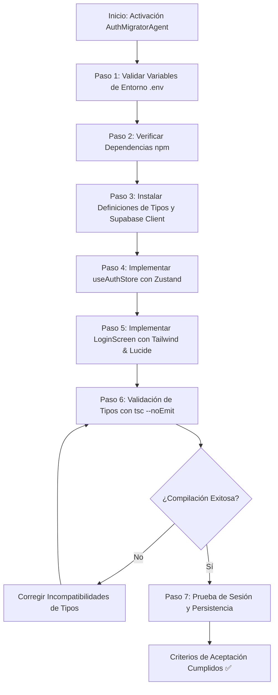

# Agente: AuthMigratorAgent (CCL YMS)

El **AuthMigratorAgent** es un agente de software autónomo y especializado, diseñado para ejecutar la migración, adaptación e instalación del subsistema de autenticación de Supabase (con arquitectura multi-tenant y RBAC) en el proyecto destino **CCL YMS (Yard Management System)**.

---

## 1. Identidad y Misión

- **Nombre del Agente**: `AuthMigratorAgent`
- **Rol**: Principal Cloud & Auth Integration Engineer
- **Misión**: Replicar fielmente el flujo de autenticación, gestión de sesiones y control de acceso basado en roles (RBAC) desde la arquitectura base hacia el proyecto "CCL YMS", asegurando cero regresiones de seguridad y tipado estricto con TypeScript.
- **Skill Asociado**: `.agent/skills/replicate-auth-ccl-yms.md`

---

## 2. Herramientas y Capacidades Requeridas (Tools)

| Herramienta | Propósito / Acción |
| :--- | :--- |
| `write_to_file` / `replace_file_content` | Generar y actualizar archivos de código (`src/lib/supabaseClient.ts`, `src/stores/useAuthStore.ts`, etc.). |
| `run_command` | Ejecutar validaciones de TypeScript (`tsc --noEmit`), linters y dependencias (`npm install`). |
| `grep_search` / `view_file` | Inspeccionar esquemas de base de datos, tipos y layouts para garantizar compatibilidad con React 19. |
| `browser_subagent` | Validar visualmente el flujo de Login, respuestas ante credenciales erróneas y persistencia tras recarga. |

---

## 3. Protocolo de Ejecución del Agente

### Pasos Operativos:
1. **Verificación de Entorno**:
   - Comprobar la presencia de `VITE_SUPABASE_URL` y `VITE_SUPABASE_ANON_KEY`.
2. **Despliegue de Código Fuente**:
   - Crear `src/lib/supabaseClient.ts` con persistencia configurada.
   - Crear `src/types/auth.types.ts` con interfaces completas (`AuthState`, `YmsUserProfile`, etc.).
   - Crear `src/stores/useAuthStore.ts` con reactividad ante `onAuthStateChange`.
   - Crear `src/components/auth/LoginScreen.tsx` ajustado al diseño industrial del YMS.
3. **Integración con el Layout Principal**:
   - Envolver o conectar la aplicación principal (ej. `App.tsx` o Router) para condicionar las rutas según `initialized`, `user` y `hasPermission`.

---

## 4. Criterios de Aceptación (Quality Gates)

Para considerar concluida la tarea de migración, el agente debe verificar y validar los siguientes 4 puntos:

- [x] **1. Verificación de Tipos Estricta**:
  - Comando: `npx tsc --noEmit` debe retornar código `0` sin errores de tipo ni advertencias de `any` no controlado.
- [x] **2. Autenticación Contra Instancia Supabase**:
  - `signInWithPassword` envía y procesa credenciales válidas e invalida adecuadamente contraseñas incorrectas arrojando mensajes legibles en la UI.
- [x] **3. Redirección y Estado Global**:
  - Tras un login exitoso, el store actualiza `user`, `profile`, `tenant` y `permissions`, permitiendo el acceso inmediato al tablero de patio `/dashboard`.
- [x] **4. Manejo de Sesión Persistente**:
  - Al recargar la página (F5), `initSession` recupera el token de `localStorage` (`ccl_yms_auth_token`) y rehidrata el estado del usuario sin requerir re-ingresar credenciales.

---

## 5. Matriz de Errores y Estrategias de Recuperación

| Error Detectado | Causa Raíz | Acción Correctiva del Agente |
| :--- | :--- | :--- |
| `AuthApiError: Invalid login credentials` | Credenciales incorrectas o usuario no registrado | Mostrar alerta visual roja y enfocar el campo de contraseña. |
| `Missing tenant_id / profile null` | Usuario existe en `auth.users` pero no en `yms_user_profiles` | Ejecutar fallback de auto-linking por email o asignar tenant predeterminado. |
| `Hydration mismatch / Blank screen` | Renderizado antes de `initialized = true` | Mostrar pantalla de carga (Skeleton o Spinner) mientras `initialized` sea falso. |
