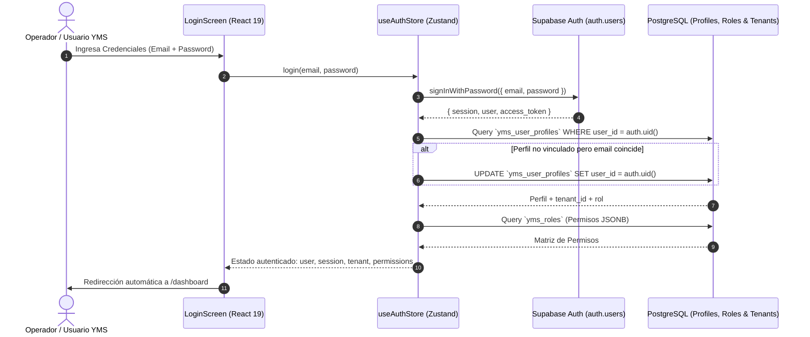

# Skill: Replicate Supabase Auth & Session Flow for CCL YMS

Este Skill proporciona el **Blueprint de Arquitectura e Implementación** para replicar el sistema de autenticación robusto, multi-nivel y con soporte RLS del sistema hacia la plataforma **CCL YMS (Yard Management System)**.

---

## 1. Arquitectura del Flujo de Autenticación

El sistema implementa un modelo de autenticación híbrido de alto rendimiento diseñado para entornos operativos industriales y logísticos:



---

## 2. Blueprint de Implementación Paso a Paso

### Paso 1: Configurar Variables de Entorno
Crear o actualizar `.env` en la raíz de **CCL YMS**:

```env
VITE_SUPABASE_URL=https://<your-project-id>.supabase.co
VITE_SUPABASE_ANON_KEY=eyJhbGciOiJIUzI1NiIsInR5cCI6IkpX...
VITE_APP_TITLE="CCL Yard Management System"
```

### Paso 2: Instalar Dependencias Requeridas
```bash
npm install @supabase/supabase-js zustand lucide-react clsx tailwind-merge
npm install -D @types/node typescript
```

---

## 3. Code Snippets Reutilizables

### A. Cliente de Supabase Configurado (`src/lib/supabaseClient.ts`)

```typescript
import { createClient } from '@supabase/supabase-js';

const supabaseUrl = import.meta.env.VITE_SUPABASE_URL as string;
const supabaseAnonKey = import.meta.env.VITE_SUPABASE_ANON_KEY as string;

if (!supabaseUrl || !supabaseAnonKey) {
  throw new Error('Faltan variables de entorno VITE_SUPABASE_URL o VITE_SUPABASE_ANON_KEY');
}

export const supabase = createClient(supabaseUrl, supabaseAnonKey, {
  auth: {
    persistSession: true,
    autoRefreshToken: true,
    detectSessionInUrl: true,
    storageKey: 'ccl_yms_auth_token'
  }
});
```

---

### B. Definiciones de Tipos TypeScript (`src/types/auth.types.ts`)

```typescript
import { User as SupabaseUser, Session as SupabaseSession } from '@supabase/supabase-js';

export interface AuthCredentials {
  email: string;
  password: string;
}

export interface YmsTenant {
  id: string;
  name: string;
  code: string;
  yardName?: string;
  active: boolean;
}

export interface PermissionItem {
  category: string;
  status: boolean;
  actions?: string[];
}

export interface YmsUserProfile {
  id: string;
  userId: string | null;
  tenantId: string;
  email: string;
  fullName: string;
  roleId: string;
  avatarUrl?: string;
}

export interface AuthState {
  user: SupabaseUser | null;
  session: SupabaseSession | null;
  profile: YmsUserProfile | null;
  tenant: YmsTenant | null;
  permissions: PermissionItem[];
  initialized: boolean;
  loading: boolean;
  error: string | null;

  // Acciones
  initSession: () => Promise<void>;
  login: (credentials: AuthCredentials) => Promise<void>;
  signUp: (credentials: AuthCredentials, fullName?: string) => Promise<void>;
  logout: () => Promise<void>;
  hasPermission: (category: string) => boolean;
  clearError: () => void;
}
```

---

### C. Tienda Zustand para Autenticación (`src/stores/useAuthStore.ts`)

```typescript
import { create } from 'zustand';
import { supabase } from '../lib/supabaseClient';
import { AuthState, AuthCredentials, YmsUserProfile, YmsTenant, PermissionItem } from '../types/auth.types';

export const useAuthStore = create<AuthState>((set, get) => ({
  user: null,
  session: null,
  profile: null,
  tenant: null,
  permissions: [],
  initialized: false,
  loading: false,
  error: null,

  clearError: () => set({ error: null }),

  initSession: async () => {
    try {
      set({ loading: true, error: null });
      const { data: { session } } = await supabase.auth.getSession();
      
      if (session?.user) {
        set({ user: session.user, session });
        await fetchProfileAndPermissions(session.user.id, session.user.email ?? '', set);
      } else {
        set({ user: null, session: null, profile: null, tenant: null, permissions: [] });
      }
    } catch (err: any) {
      console.error('Error al inicializar sesión YMS:', err);
      set({ error: err.message });
    } finally {
      set({ initialized: true, loading: false });
    }

    // Listener para cambios de estado de auth en tiempo real
    supabase.auth.onAuthStateChange(async (_event, newSession) => {
      if (newSession?.user) {
        set({ user: newSession.user, session: newSession });
        await fetchProfileAndPermissions(newSession.user.id, newSession.user.email ?? '', set);
      } else {
        set({ user: null, session: null, profile: null, tenant: null, permissions: [] });
      }
    });
  },

  login: async ({ email, password }: AuthCredentials) => {
    set({ loading: true, error: null });
    try {
      const { data, error } = await supabase.auth.signInWithPassword({
        email: email.trim().toLowerCase(),
        password
      });
      if (error) throw error;

      set({ user: data.user, session: data.session });
      if (data.user) {
        await fetchProfileAndPermissions(data.user.id, data.user.email ?? '', set);
      }
    } catch (err: any) {
      set({ error: err.message || 'Error al iniciar sesión en CCL YMS' });
      throw err;
    } finally {
      set({ loading: false });
    }
  },

  signUp: async ({ email, password }: AuthCredentials, fullName?: string) => {
    set({ loading: true, error: null });
    try {
      const { data, error } = await supabase.auth.signUp({
        email: email.trim().toLowerCase(),
        password,
        options: {
          data: { full_name: fullName }
        }
      });
      if (error) throw error;
      set({ user: data.user, session: data.session });
    } catch (err: any) {
      set({ error: err.message || 'Error al registrar usuario' });
      throw err;
    } finally {
      set({ loading: false });
    }
  },

  logout: async () => {
    set({ loading: true });
    try {
      localStorage.removeItem('ccl_yms_active_tab');
      await supabase.auth.signOut();
      set({
        user: null,
        session: null,
        profile: null,
        tenant: null,
        permissions: [],
        error: null
      });
    } catch (err: any) {
      console.error('Error al cerrar sesión:', err);
    } finally {
      set({ loading: false });
    }
  },

  hasPermission: (category: string): boolean => {
    const { profile, permissions } = get();
    if (!profile) return false;
    if (profile.roleId === 'SUPERADMIN' || profile.roleId === 'ADMIN') return true;
    
    const perm = permissions.find(p => p.category.toUpperCase() === category.toUpperCase());
    return perm ? perm.status : false;
  }
}));

// Helper interno para carga de perfil, tenant y permisos RBAC
async function fetchProfileAndPermissions(userId: string, email: string, set: any) {
  try {
    // 1. Buscar perfil por user_id
    let { data: profile } = await supabase
      .from('yms_user_profiles')
      .select('*')
      .eq('user_id', userId)
      .maybeSingle();

    // 2. Auto-vínculo por email si es primera vez
    if (!profile && email) {
      const { data: emailProfile } = await supabase
        .from('yms_user_profiles')
        .select('*')
        .eq('email', email.toLowerCase())
        .is('user_id', null)
        .maybeSingle();

      if (emailProfile) {
        const { data: linked } = await supabase
          .from('yms_user_profiles')
          .update({ user_id: userId })
          .eq('id', emailProfile.id)
          .select()
          .single();
        profile = linked;
      }
    }

    if (profile) {
      const mappedProfile: YmsUserProfile = {
        id: profile.id,
        userId: profile.user_id,
        tenantId: profile.tenant_id,
        email: profile.email,
        fullName: profile.full_name || profile.nombre || 'Operador YMS',
        roleId: profile.role_id || profile.rol_name || 'OPERADOR',
        avatarUrl: profile.avatar_url
      };

      // 3. Cargar Tenant
      const { data: tenantData } = await supabase
        .from('yms_tenants')
        .select('*')
        .eq('id', profile.tenant_id)
        .single();

      // 4. Cargar Permisos RBAC
      let permissions: PermissionItem[] = [];
      if (mappedProfile.roleId !== 'ADMIN' && mappedProfile.roleId !== 'SUPERADMIN') {
        const { data: roleData } = await supabase
          .from('yms_roles')
          .select('permissions')
          .eq('name', mappedProfile.roleId)
          .single();
        permissions = roleData?.permissions || [];
      }

      set({
        profile: mappedProfile,
        tenant: tenantData || null,
        permissions
      });
    }
  } catch (err) {
    console.error('Error cargando metadata del perfil:', err);
  }
}
```

---

### D. Componente UI de Login (`src/components/auth/LoginScreen.tsx`)

```tsx
import React, { useState } from 'react';
import { Truck, Lock, Mail, LogIn, ShieldAlert, ArrowRight, Warehouse } from 'lucide-react';
import { useAuthStore } from '../../stores/useAuthStore';

interface LoginScreenProps {
  onSuccess?: () => void;
}

export const LoginScreen: React.FC<LoginScreenProps> = ({ onSuccess }) => {
  const [email, setEmail] = useState('');
  const [password, setPassword] = useState('');
  const [isSignUp, setIsSignUp] = useState(false);
  const [fullName, setFullName] = useState('');

  const { login, signUp, loading, error, clearError } = useAuthStore();

  const handleSubmit = async (e: React.FormEvent) => {
    e.preventDefault();
    clearError();

    try {
      if (isSignUp) {
        await signUp({ email, password }, fullName);
        alert('Registro completado. Puedes iniciar sesión con tus credenciales.');
        setIsSignUp(false);
      } else {
        await login({ email, password });
        onSuccess?.();
      }
    } catch {
      // El error queda administrado en el store
    }
  };

  return (
    <div className="min-h-screen bg-slate-950 flex items-center justify-center p-4 sm:p-6 font-sans relative overflow-hidden">
      {/* Background Glows */}
      <div className="absolute top-1/4 left-1/4 w-96 h-96 bg-blue-600/10 rounded-full blur-3xl pointer-events-none" />
      <div className="absolute bottom-1/4 right-1/4 w-96 h-96 bg-amber-500/10 rounded-full blur-3xl pointer-events-none" />

      <div className="w-full max-w-md relative z-10">
        <div className="bg-slate-900/90 backdrop-blur-xl rounded-3xl border border-slate-800 shadow-2xl shadow-black/60 overflow-hidden">
          
          {/* Header Banner */}
          <div className="bg-gradient-to-b from-slate-800 to-slate-900 p-8 text-center border-b border-slate-800/80 relative">
            <div className="inline-flex p-3.5 bg-blue-500/10 border border-blue-500/20 rounded-2xl mb-3 shadow-inner">
              <Truck className="text-blue-400 w-8 h-8" />
            </div>
            <div className="flex items-center justify-center gap-2 mb-1">
              <span className="text-xl font-black text-white tracking-wider">CCL</span>
              <span className="text-xl font-light text-blue-400 tracking-widest">YMS</span>
            </div>
            <p className="text-slate-400 text-xs font-semibold uppercase tracking-widest">
              {isSignUp ? 'Registro de Operador' : 'Control de Patio & Flotas'}
            </p>
          </div>

          {/* Form Content */}
          <div className="p-8 space-y-6">
            <form onSubmit={handleSubmit} className="space-y-4">
              
              {isSignUp && (
                <div className="space-y-1.5">
                  <label className="text-xs font-bold text-slate-300 uppercase tracking-wider">
                    Nombre Completo
                  </label>
                  <div className="relative">
                    <Warehouse className="absolute left-4 top-1/2 -translate-y-1/2 w-4 h-4 text-slate-500" />
                    <input
                      type="text"
                      required
                      value={fullName}
                      onChange={(e) => setFullName(e.target.value)}
                      placeholder="Ej. Juan Pérez"
                      className="w-full pl-11 pr-4 py-3 bg-slate-950/60 border border-slate-800 rounded-xl text-sm text-slate-100 placeholder:text-slate-600 focus:outline-none focus:border-blue-500 focus:ring-1 focus:ring-blue-500 transition"
                    />
                  </div>
                </div>
              )}

              <div className="space-y-1.5">
                <label className="text-xs font-bold text-slate-300 uppercase tracking-wider">
                  Correo Corporativo
                </label>
                <div className="relative">
                  <Mail className="absolute left-4 top-1/2 -translate-y-1/2 w-4 h-4 text-slate-500" />
                  <input
                    type="email"
                    required
                    value={email}
                    onChange={(e) => setEmail(e.target.value)}
                    placeholder="operador@ccl.com"
                    className="w-full pl-11 pr-4 py-3 bg-slate-950/60 border border-slate-800 rounded-xl text-sm text-slate-100 placeholder:text-slate-600 focus:outline-none focus:border-blue-500 focus:ring-1 focus:ring-blue-500 transition"
                  />
                </div>
              </div>

              <div className="space-y-1.5">
                <label className="text-xs font-bold text-slate-300 uppercase tracking-wider">
                  Contraseña
                </label>
                <div className="relative">
                  <Lock className="absolute left-4 top-1/2 -translate-y-1/2 w-4 h-4 text-slate-500" />
                  <input
                    type="password"
                    required
                    value={password}
                    onChange={(e) => setPassword(e.target.value)}
                    placeholder="••••••••••••"
                    className="w-full pl-11 pr-4 py-3 bg-slate-950/60 border border-slate-800 rounded-xl text-sm text-slate-100 placeholder:text-slate-600 focus:outline-none focus:border-blue-500 focus:ring-1 focus:ring-blue-500 transition"
                  />
                </div>
              </div>

              {error && (
                <div className="p-3 bg-red-950/50 border border-red-800/80 rounded-xl flex items-center gap-2.5 text-red-300 text-xs font-medium animate-in fade-in">
                  <ShieldAlert className="w-4 h-4 flex-shrink-0 text-red-400" />
                  <span>{error}</span>
                </div>
              )}

              <button
                type="submit"
                disabled={loading}
                className="w-full mt-2 py-3.5 px-4 bg-blue-600 hover:bg-blue-500 disabled:bg-slate-800 disabled:text-slate-600 text-white rounded-xl text-xs font-bold uppercase tracking-wider shadow-lg shadow-blue-900/30 flex items-center justify-center gap-2 transition duration-150 active:scale-[0.98]"
              >
                {loading ? (
                  <div className="w-4 h-4 border-2 border-white/30 border-t-white rounded-full animate-spin" />
                ) : (
                  <>
                    <LogIn className="w-4 h-4" />
                    <span>{isSignUp ? 'Crear Cuenta' : 'Acceder a Patio'}</span>
                    <ArrowRight className="w-4 h-4 ml-1 opacity-70" />
                  </>
                )}
              </button>
            </form>

            <div className="pt-2 text-center border-t border-slate-800/60">
              <button
                type="button"
                onClick={() => {
                  clearError();
                  setIsSignUp(!isSignUp);
                }}
                className="text-xs font-semibold text-slate-400 hover:text-blue-400 transition"
              >
                {isSignUp
                  ? '¿Ya tienes acceso? Inicia sesión'
                  : '¿Nuevo operador en patio? Solicita o regístrate aquí'}
              </button>
            </div>
          </div>
        </div>

        {/* Footer */}
        <p className="text-center mt-6 text-[11px] text-slate-600 font-medium tracking-wide">
          CCL Logistics & Yard Management System • v1.0
        </p>
      </div>
    </div>
  );
};
```

---

## 4. Checklist de Verificación de Integración

- [ ] Las tablas `yms_user_profiles`, `yms_tenants` y `yms_roles` cuentan con RLS habilitado.
- [ ] La clave `ccl_yms_auth_token` guarda y recupera la sesión al refrescar el navegador (F5).
- [ ] La función `hasPermission('PATIO_ENTRADA')` responde adecuadamente en base al rol asignado.
- [ ] `useAuthStore` maneja el estado `initialized` para evitar pantallas blancas durante el renderizado inicial.
